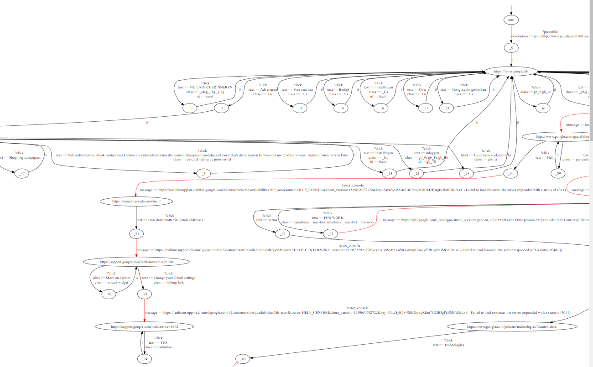

[](https://travis-ci.org/lenntt/kinglouie)
<a href="https://codeclimate.com/github/lenntt/kinglouie/maintainability"></a>
<a href="https://codeclimate.com/github/lenntt/kinglouie/test_coverage"></a>

# Description

Your exploratory test monkey that becomes smarter over time.

_King Louie:_
>_Oh, oobee doo_<br/>
>_I wanna be like you_<br/>
>_I wanna walk like you_<br/>
>_Talk like you, too_<br/>
>_You'll see it's true_<br/>
>_An ape like me_<br/>
>_Can learn to be human too_


# Prerequisites

* `nodejs` >= 8 (depending on `async` and using es6), with `npm`
* Chrome

# To run

clone this repo and
```
npm install
npm test
node samples/google/main.js
```



# Definitions

## The Labelled Transition System
* A `Model` (Labeled Transition System), consists of:
    * `Label`s
        * A label is either a `stimulus` (e.g. click), a `response` (e.g. an error), or `quiesence` (δ, absence of any output).
        * Can define parameters
    * `State`s
        * Which have outgoing `Transition`s
            * Which have a `from` state, a `label`, and a `to` state.
            * May have a `guard` which specifies conditions on label parameters
        * One state is the `initialState`
* An `InstantiatedLabel` is a label, but with actual data and meta data.
* A `Trace` is a list of observed `InstantiatedLabel`s.

## The Adapter
You must implement an `Adapter`, which is an object that has async functions `preamble`, `waitForOutput` and `determineState`. See samples (samples/google/main.js).
The `adapter` folder contains predefined methods to interact with a page.

## KingLouie
Is using your `Adapter` and builds up an observation `Model`.


# Known limitations
- Kinglouie does not interact with iframes or new windows (popups).
- Kinglouie does not handle modal dialogs (e.g. `alert()`);

